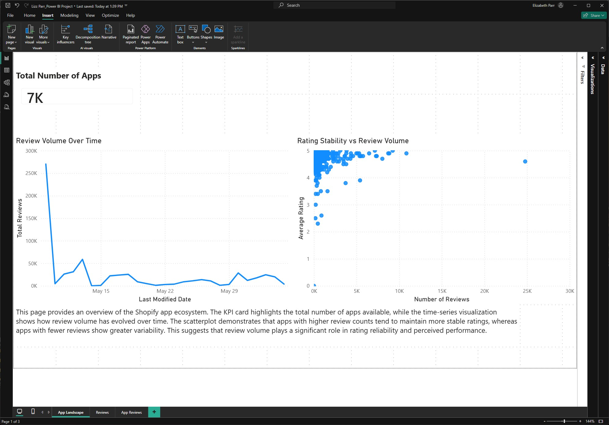
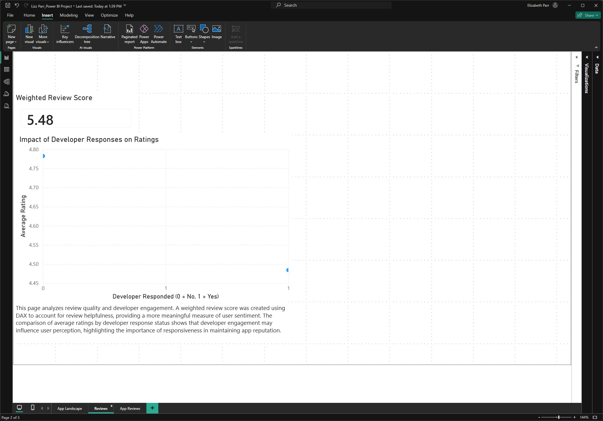
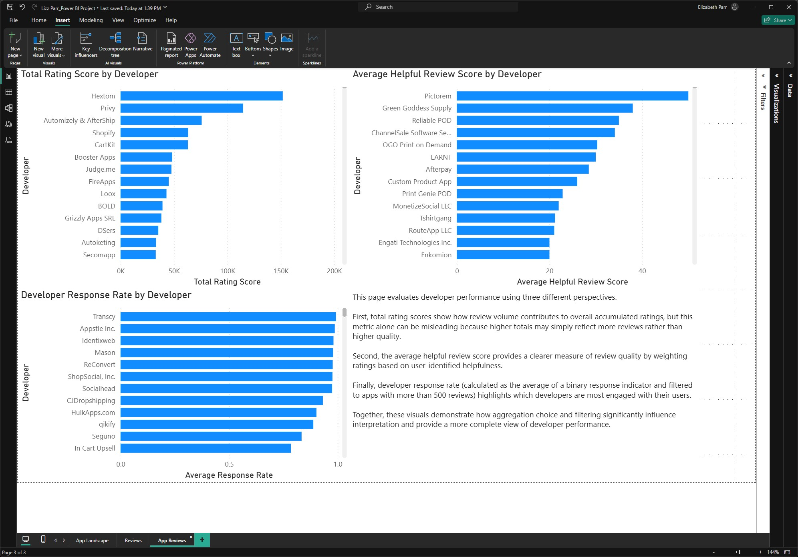

# 📊 App Reviews & Developer Engagement Analysis (Power BI)

## 🔍 Project Overview
This project explores how user reviews and developer engagement impact app performance. Using Power BI, I built a multi-page report to analyze rating accumulation, review quality, response behavior, and rating stability.

The goal was not just to visualize data — but to interpret how review volume and developer responsiveness influence user perception.

## 📈 Business Questions Explored
- Do developers with more reviews accumulate higher total ratings?
- Does review volume affect rating stability?
- Which developers are most responsive to user feedback?
- Does developer engagement correlate with stronger ratings?
- How does filtering by meaningful review volume (>500 reviews) change interpretation?

## 📊 Key Insights
- High total rating scores are often driven by larger review volume  
- Apps with fewer reviews show greater rating volatility (small sample effect)  
- Developers with higher response rates demonstrate stronger engagement  
- Helpful review averages provide clearer quality insight than raw rating totals  

## 🧠 Technical Skills Demonstrated

### 🔹 Data Modeling
- Built a relationship between `Reviews` and `Apps` tables (`app_id → id`)  
- Applied filtering (`reviews_count > 500`) for more meaningful insights  

### 🔹 DAX Calculations
- Created calculated columns using conditional logic  
- Built response-rate metrics using binary indicators (0/1)  
- Applied appropriate aggregations (SUM vs AVG)  

### 🔹 Data Visualization & Storytelling
- Designed business-friendly titles and labels  
- Replaced auto-generated labels for clarity  
- Added annotations to support interpretation  
- Structured visuals to compare volume vs quality metrics  

## 🛠️ Tools Used
- Power BI  
- DAX  
- Data Modeling  
- Data Visualization  

## 👤 Author
Elizabeth Parr
